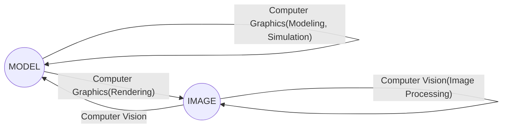

Lingqi Yan's works of niubihonghong
<!-- more -->

## what

The use of computers to synthesize and manipulate visual information.

it applied in vidio Games,Movies,Animations,cad/cam/cae Desigh,visualization,virtual reality,digital lllustration,simulation,gui,Typography.etc

## why

Fundamental Intellectual Challenges

- Creates and interacts with realistic virtual world
- Requires understanding of all aspects of physical world
- New computing methods, displays, technologies

Technical Challenges

- Math of (perspective) projections, curves, surfaces
- Physics of lighting and shading
- Representing / operating shapes in 3D
- Animation / simulation

## Topics

### Rasterization

- Project geometry primitives (3D triangles / polygons) onto the screen
- Break projected primitives into fragments (pixels)
- Gold standard in Video Games (Real-time Applications)

### Curves and Meshes

How to represent geometry in Computer Graphics

### Ray Tracing

- Shoot rays from the camera though each pixel
  - Calculate intersection and shading
  - Continue to bounce the rays till they hit light sources
- Gold standard in Animations / Movies (Offline Applications)

### Animation/Simulation

## Not about



- not about OpenGL/DirectX/Vulkan
- not about shaders
- not about 3d modeling. suach as mata/blender
- not about cv/deep learning



## References

Steve Marschner and Peter Shirley, "Fundamentals of Computer Graphics",3rd or later edition.

